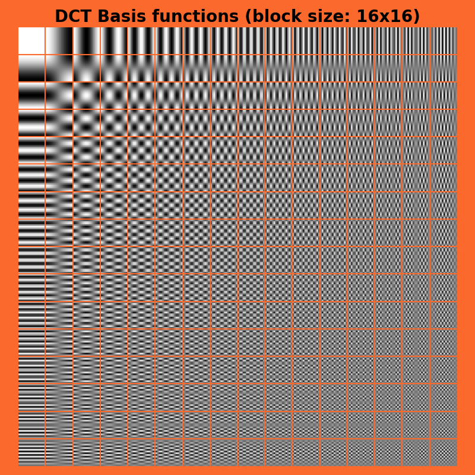

# torch-dct
Discrete Cosine Transform in PyTorch




## Usage

```python
from PIL import Image
from torch_dct import DCTModule
import numpy as np

dct_module = DCTModule(block_size=32)

image = Image.open('path/to/image.jpg')
# currently only grayscale images are supported so convert to grayscale
image = image.convert('L')
# dct_module expects numpy arrays
img_np = np.array(image)
# encode the image
encodings = dct_module.encode(img_np)
# decode the image, Note that, except for some floating point errors, the reconstructed image should be the same as the original image (Lossless).
reconstruction = dct_module.decode(encodings)
# result is a numpy array so convert back to PIL image
reconstruction = Image.fromarray(reconstruction)
```

## TODO

- [ ] Add support for color images
- [ ] Improve documentation
- [ ] Add tests
- [ ] Distribute on PyPI